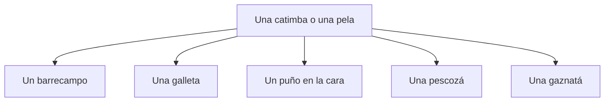

En Puerto Rico hay muchísimas distintas jergas para comunicar que le diste un golpe a alguien. Dependiendo del contexto, unas peores que otras.

Cualquiera de estas puede ser parte de una catimba o una pela.

A slap or hit, typically to the face or head; roughly equivalent to "a smack" or "a slap."

Existen muchísimas maneras de expresar un golpe individual:
- Una bofetá.
- Una pescozá.
- Una gaznatá.
- Un puño en la cara.
- Una galleta.
- Un barrecampo.

## Literal translation (English)
"A cookie / a throat-slap / a neck-slap."
## Usage
- *"Te voy a dar una galleta."* (Can literally mean a cookie depending on tone.)
- *"Le metí una gaznatá."*
- *"Te voy a dar una pescozá que vas a ver."*
- *"Le dieron una catimba."*
- *"Te van a dar una catimba si sigues."*
- *"Se ganaron una catimba bien dada."*

## Related expressions

- **Una prendía** — a hard slap.
- **Darle como pillo de película** — to beat someone up dramatically.

## Origin
"Galleta" (cookie) references the round, flat shape and the sound of a slap. "Gaznatá" comes from "gaznate" (throat/gullet), referring to strikes to that area. "Pescozá" derives from "pescuezo" (neck). "Catimba" has uncertain origins; possibly onomatopoeic or derived from African-influenced Caribbean Spanish.
