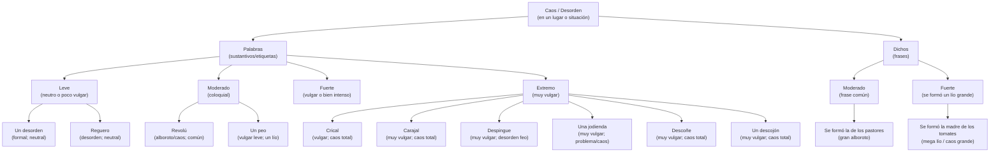
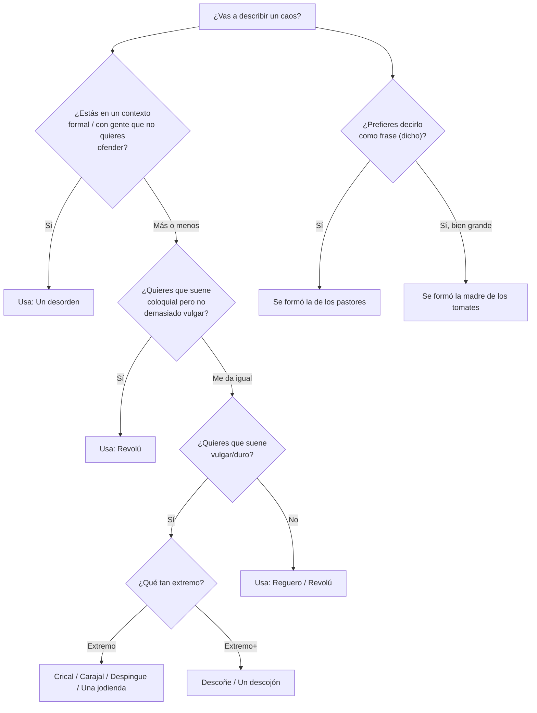

> [!WARNING] Esta página está incompleta. #wip

En Puerto Rico hay muchísimas maneras de decir que hay un caos total en un lugar
o situación.

En este wiki page, intentamos contestar la pregunta más importante de nuestro siglo:

> ¿Cúal crical es el peor crical?

## La jerarquía de severidad

## ¿Cuál palabra usar?

> Nota: La “severidad” aquí combina intensidad + cuán vulgar suena en conversación
> casual.

## Palabras

### Con páginas propias

- [[Crical]]
- [[Carajal]]
- [[Despingue]]
- [[Descoñe]]
- [[Peo]]
- [[Jodienda]]
- [[Descojón]]
- [[Revolú]]

### Otros (sin página propia)

- **Un desorden** — forma neutral/formal; para contextos donde no quieres
  sonar vulgar.
- **Reguero** — desorden físico o figurado; bastante común y neutral.

## Dichos

- [[La de los pastores]]
- [[La madre de los tomates]]

## Poorly Named Businesses

Los únicos individuos en el archipiélago puertorriqueño que pueden usar la palabra
"crical" sin ironía o vulgaridad alguna: los billaristas.

Perfecto "case study" de porqué vale la pena invertir en DEI:

![[./_attachments/crical-billiards-google-search.png]]
![[./_attachments/crical-billiards-reddit.png]]

Si hubiera habido un boricua--uno solo--en ese bendito equipo esto no hubiera
ocurrido. Ahora tienen un... *crical*. Ja.

Por el otro lado...

![[./_attachments/crical-domain-for-sale.png]]
