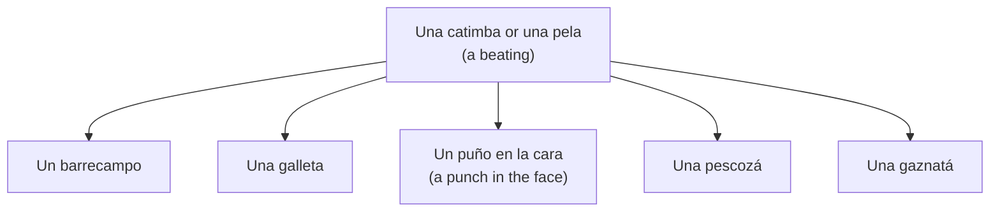

Puerto Rican Spanish has a remarkable number of ways to say that someone was hit. Some are more severe than others, and context matters.

Any of these blows might form part of *una catimba* or *una pela*—a beating.

The following expressions generally describe one slap or blow, often to the face, head, neck, or throat:

- *Una bofetá* — a slap.
- *Una pescozá* — a strike around the neck, from *pescuezo*.
- *Una gaznatá* — a blow near the throat, from *gaznate*.
- *Un puño en la cara* — a punch in the face.
- *Una galleta* — literally “a cookie,” but here a smack or slap.
- *Un barrecampo* — a powerful sweeping blow.

## Usage

- *Te voy a dar una galleta.* — I’m going to smack you. (Tone determines whether *galleta* means a slap or an actual cookie.)
- *Le metí una gaznatá.* — I hit them in the throat/neck.
- *Te voy a dar una pescozá que vas a ver.* — I’ll give you such a smack you’ll see.
- *Le dieron una catimba.* — They gave him a beating.
- *Te van a dar una catimba si sigues.* — They will beat you if you keep going.

## Related expressions

- *Una prendía* — a hard slap.
- *Darle como pillo de película* — to beat someone up dramatically, like a movie villain.
- [[en/Artículos/Las miles de maneras de dar una golpiza|The thousand ways to describe a beating]].

## Origin notes

*Galleta* may invoke the flat, round shape or sharp sound of a slap. *Gaznatá* derives from *gaznate* (throat or gullet), while *pescozá* derives from *pescuezo* (neck). The origin of *catimba* is uncertain and may reflect African-influenced Caribbean Spanish or sound symbolism.
