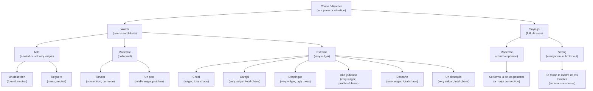

> [!WARNING] This page is incomplete. #wip

Puerto Rican Spanish has countless ways to describe complete chaos in a place or situation. This page attempts to answer the most important question of our century:

> *¿Cuál crical es el peor crical?* — Which kind of chaos is the worst chaos?

## A rough hierarchy of intensity

## Which word should you use?

- **Formal or inoffensive:** *un desorden* or *un reguero*.
- **Colloquial but not very vulgar:** [[en/Palabras/Revolú|*revolú*]].
- **A mild vulgar edge:** [[en/Palabras/Peo|*un peo*]].
- **Strong and vulgar:** [[en/Palabras/Crical|*crical*]], [[en/Palabras/Carajal|*carajal*]], [[en/Palabras/Despingue|*despingue*]], or [[en/Palabras/Jodienda|*una jodienda*]].
- **Extreme:** [[en/Palabras/Descoñe|*descoñe*]] or [[en/Palabras/Descojón|*un descojón*]].
- **As a full saying:** [[en/Dichos/La de los pastores|*se formó la de los pastores*]] or [[en/Dichos/La madre de los tomates|*se formó la madre de los tomates*]].

> [!NOTE] “Severity” combines intensity with how vulgar the expression sounds in casual conversation. Real usage varies by speaker and setting.

## Poorly named businesses

The only people in the Puerto Rican archipelago who can use *crical* with no irony or vulgarity at all: billiards players.

This is a perfect case study for why cultural review matters:

![[../../Artículos/_attachments/crical-billiards-google-search.png]]
![[../../Artículos/_attachments/crical-billiards-reddit.png]]

If there had been one Boricua—just one—on that blessed team, this would not have happened. Now they have a… *crical*. Ja.

On the other hand…

![[../../Artículos/_attachments/crical-domain-for-sale.png]]
