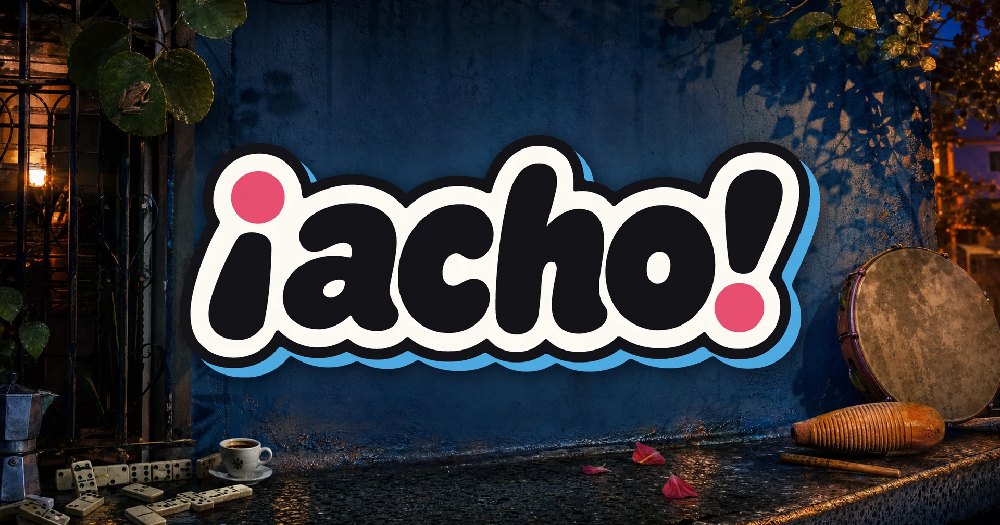

¡Dímelo! Welcome to acho.lol, an irreverent, playful, 100% Puerto Rican encyclopedia.

> For example, did you know that in Puerto Rico a *galleta*—literally a
> “cookie”—can be [[en/Artículos/Las miles de maneras de dar un golpe|something you definitely do not want]]?

In this wiki, [[en/Meta/La misión|we preserve a little bit of everything]]: from the eternal fight
over whether fried turnovers are *[[en/Controversias/¿Empanadilla o pastelillo?|pastelillos or empanadillas]]*,
to the more serious parts of our culture.

We hope you discover something new—and pick up some Puerto Rican Spanish along the way.

> [!TIP] For language learners
> Puerto Rican words and expressions stay in Spanish. The English explanation gives you
> the meaning, tone, and context rather than flattening everything into a literal translation.
> Use the language link in the sidebar to compare any entry with its Spanish original.

## Explore

- **[[en/Dichos/index|Sayings]]** — Puerto Rican phrases, expressions, and proverbs.
- **[[en/Palabras/index|Words]]** — The Puerto Rican lexicon.
- **[[en/Artículos/index|Articles]]** — Thematic hubs connecting related concepts.
- **[[en/Personas/index|People]]** — Biographies and profiles.
- **[[en/Fauna/index|Wildlife]]** — Puerto Rico’s animals and their Boricua names.
- **[[en/Controversias/index|Controversies]]** — The eternal Puerto Rican debates.

## Help us out!

Building a giant wiki of Puerto Rican culture is
[[en/Meta/Tasks|a pretty big job]] for one person from Caguas.
We are great, but *[[en/Controversias/Los municipios mas tóxicos de Puerto Rico|not that great]]*.

If you would like to write or contribute, let us know.
We are [[en/Meta/🏝️ islita.club|forming a group]] interested in preserving Puerto Rican popular culture.

[[en/Meta/¿Cómo contribuyo?|How can I contribute?]]
