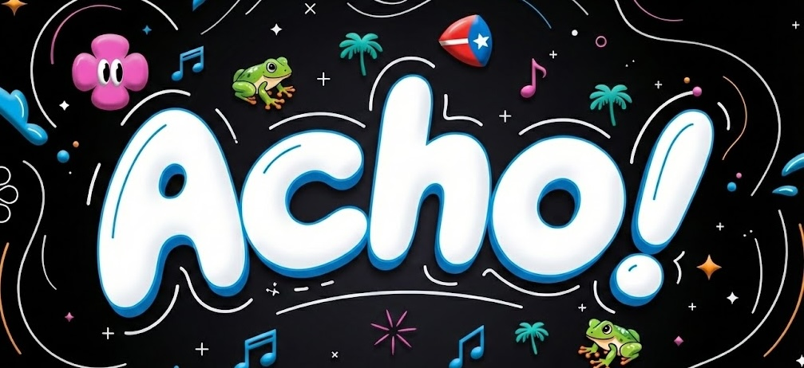

¡Dímelo! Bienvenidos a acho.lol, una enciclopedia irreverente, jocosa y 100% boricua.

> Por ejemplo, ¿sabías que en Puerto Rico una galleta puede ser
> [[Las miles de maneras de dar un golpe|algo indeseable]]?

En este wiki [[La misión|preservamos de todo]]: desde la eterna pelea
sobre que son los [[¿Empanadilla o pastelillo?|pastelillos]],
hasta los aspectos más serios de nuestra cultura.

¡Espero que descubras algo nuevo!

## Explora

- **[[Dichos/index|Dichos]]** — Frases, expresiones y refranes boricuas.
- **[[Palabras/index|Palabras]]** — El léxico puertorriqueño.
- **[[Artículos/index|Artículos]]** — Hubs temáticos que conectan conceptos.
- **[[Personas/index|Personas]]** — Biografías y perfiles.
- **[[Fauna/index|Fauna]]** — Los animales de Puerto Rico y sus nombres boricuas.
- **[[Controversias/index|Controversias]]** — Las eternas peleas boricuas.

## ¡Ayúdame!

Crear un wiki gigante de la cultura puertorriqueña es
[[Tasks|una tarea un poco grande]] para un solo cagüeño.
Somos grandes, pero [[Los municipios mas tóxicos de Puerto Rico|no tan grandes]].

Si te interesa ser autor o contribuir a algo aquí, déjame saber.
Estoy [[Meta/🏝️ islita.club|formando un grupo]] interesado en preservar la cultura popular puertorriqueña.

[[¿Cómo contribuyo?]]
